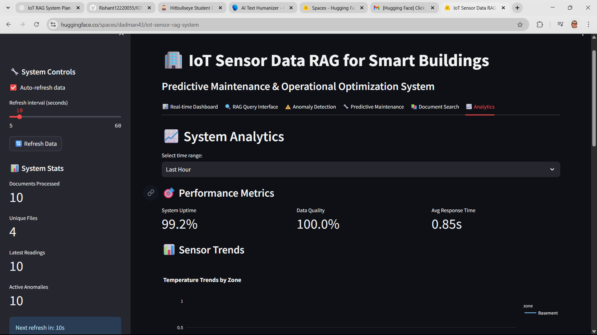
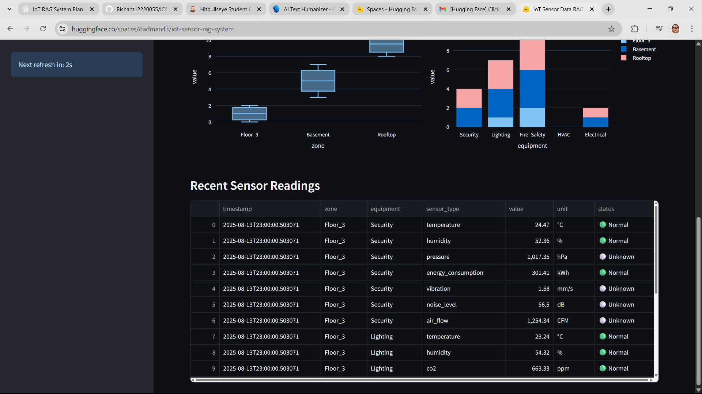
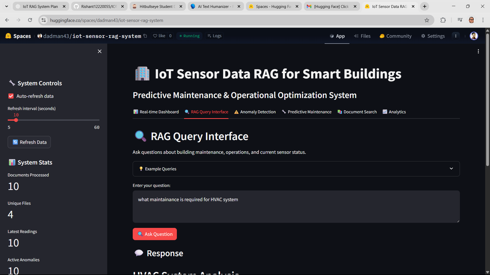
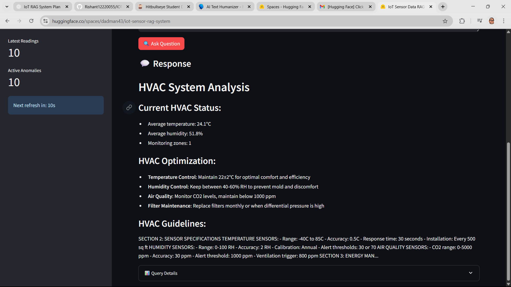
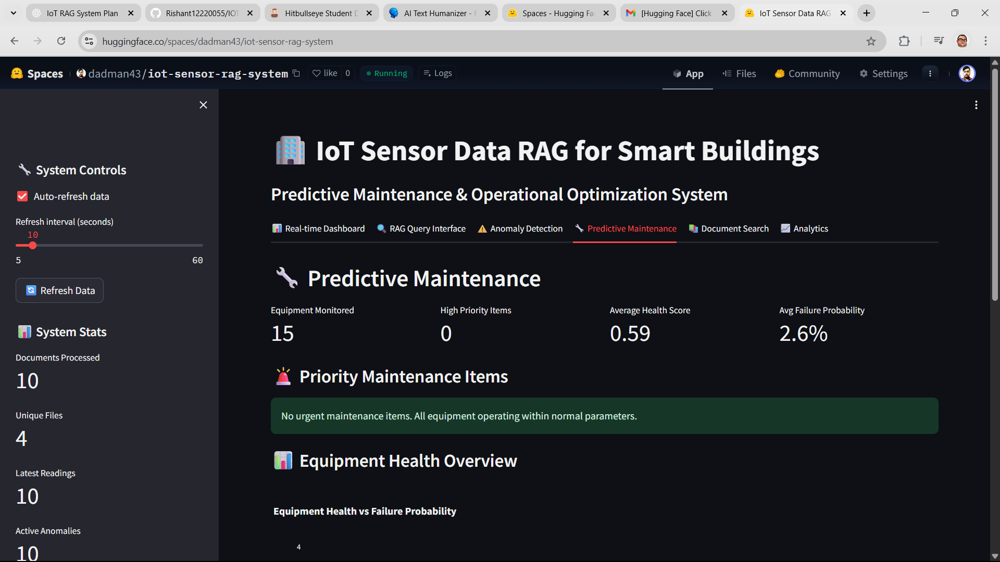

# IoT Sensor Data RAG for- **Data Processing**: Pandas and NumPy for sensor data analysis

## 📸 Screenshots

### 🏠 Main Dashboardt Buildings

### 📈 Analytics Dashboard

*Advanced analytics with sensor correlations and trend analysis*

## 🚀 Quick Start Live Demo**: Experience all these features live at [https://huggingface.co/spaces/dadman43/iot-sensor-rag-system](https://huggingface.co/spaces/dadman43/iot-sensor-rag-system)

A comprehensive Retrieval-Augmented Generation (RAG) system that processes IoT sensor data, maintenance manuals, and building specifications to provide predictive maintenance insights and operational optimization for smart buildings.

## 🏢 Features

- **Real-time IoT Sensor Data Processing**: Ingests and processes sensor data from HVAC, electrical, and security systems
- **Document Integration**: Processes maintenance manuals and building specifications
- **Predictive Maintenance**: ML-powered failure prediction and maintenance scheduling
- **Anomaly Detection**: Real-time detection of unusual sensor patterns
- **Operational Optimization**: Energy efficiency and system performance recommendations
- **Interactive Dashboard**: Streamlit-based web interface for monitoring and querying

## 🔧 Technical Architecture

- **Frontend**: Streamlit web application
- **Vector Database**: ChromaDB for document embeddings
- **Embeddings**: HuggingFace Sentence Transformers
- **ML Models**: Scikit-learn for anomaly detection and predictive maintenance
- **Data Processing**: Pandas and NumPy for sensor data analysis

## � Screenshots

### 🏠 Main Dashboard

*Real-time IoT sensor monitoring with interactive charts and system overview*

### 📊 Real-time Sensor Data

*Live sensor readings from HVAC, electrical, and security systems across building zones*

### 🚨 Anomaly Detection

*Real-time anomaly detection with alerts and detailed sensor analysis*

### 🔧 Predictive Maintenance

*ML-powered maintenance recommendations and equipment health monitoring*

### 🤖 RAG Q&A System

*Intelligent question-answering with context-aware responses from maintenance manuals*

### 📈 Analytics Dashboard

*Advanced analytics with sensor correlations and trend analysis*

## �🚀 Quick Start

### Prerequisites

- Python 3.8+
- pip package manager

### Installation

1. Clone the repository:
```bash
git clone https://github.com/Rishant12220055/IOT-Rag-Sytem-Plan.git
cd IOT-Rag-Sytem-Plan
```

2. Install dependencies:
```bash
pip install -r requirements.txt
```

3. Set up environment variables (optional):
```bash
# Create .env file for OpenAI API key (if using)
echo "OPENAI_API_KEY=your_api_key_here" > .env
```

### Running the Application

1. Start the Streamlit app:
```bash
streamlit run streamlit_app.py
```

2. Open your browser to `http://localhost:8501`

## 📊 System Components

### 1. IoT Data Ingestion
- Simulated sensor data from multiple building systems
- Real-time data streaming simulation
- Multi-sensor data fusion and correlation

### 2. Document Processing
- PDF and DOCX maintenance manual processing
- Intelligent chunking strategies for technical documents
- Vector embedding storage in ChromaDB

### 3. Predictive Maintenance
- Equipment failure prediction using ML models
- Maintenance scheduling optimization
- Historical trend analysis

### 4. Anomaly Detection
- Real-time sensor anomaly detection
- Threshold-based and ML-based detection methods
- Alert generation and notification system

### 5. RAG Pipeline
- Context-aware document retrieval
- Maintenance recommendation generation
- Operational efficiency insights

## 📁 Project Structure

```
iot-sensor-rag/
├── streamlit_app.py              # Main Streamlit application
├── src/
│   ├── data_ingestion.py         # IoT data processing
│   ├── document_processor.py     # Document chunking and embedding
│   ├── rag_pipeline.py          # RAG implementation
│   ├── anomaly_detection.py     # Anomaly detection algorithms
│   ├── predictive_maintenance.py # Predictive maintenance models
│   └── utils.py                 # Utility functions
├── data/
│   ├── sensor_data/             # IoT sensor datasets
│   └── documents/               # Maintenance manuals and specs
├── docs/                        # Documentation
├── requirements.txt             # Python dependencies
└── README.md                   # This file
```

## 🔍 Usage Examples

### Query the System
- "What maintenance is needed for HVAC system based on current sensor readings?"
- "Analyze energy efficiency patterns in Building A"
- "Check for any anomalies in the electrical system"

### Monitor Real-time Data
- View live sensor readings from all building systems
- Track anomaly detection alerts
- Monitor predictive maintenance recommendations

## 📈 Evaluation Metrics

The system tracks several key metrics:
- **Retrieval Accuracy**: Relevance of retrieved documents
- **Response Latency**: Time to generate recommendations
- **Anomaly Detection Precision**: False positive/negative rates
- **Prediction Accuracy**: Maintenance prediction accuracy

## 🚀 Deployment

### Streamlit Cloud
1. Push code to GitHub
2. Connect repository to Streamlit Cloud
3. Deploy with one click

### HuggingFace Spaces
1. Create new Space on HuggingFace
2. Upload files or connect GitHub repo
3. Select Streamlit as framework

## 🛠️ Customization

### Adding New Sensor Types
1. Update `data_ingestion.py` with new sensor schemas
2. Modify anomaly detection thresholds
3. Update predictive models for new equipment types

### Document Integration
1. Add new document types to `document_processor.py`
2. Customize chunking strategies for specific document formats
3. Update embedding models for domain-specific content

## 📝 License

This project is licensed under the MIT License.

## 🤝 Contributing

1. Fork the repository
2. Create a feature branch
3. Make your changes
4. Submit a pull request

## 📞 Support

For questions and support, please create an issue in the GitHub repository.

---

**Live Demo**: https://huggingface.co/spaces/dadman43/iot-sensor-rag-system
**GitHub Repository**: https://huggingface.co/spaces/dadman43/iot-sensor-rag-system
